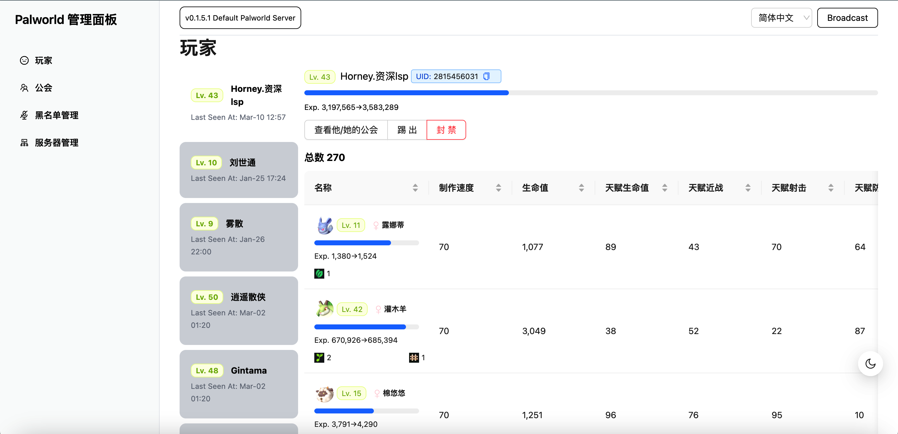
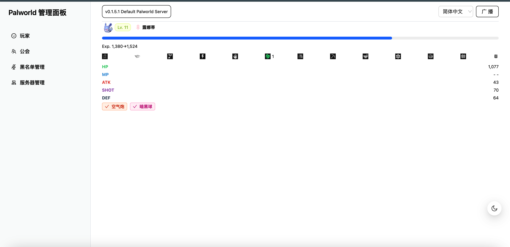

# Palworld Dedicated Server Admin Panel

<p align="center">
   <strong >English</strong> | <a href="/README.cn.md">简体中文</a>
</p>

This project is built for single dedicated servers to easily view/manage palworld server stats.

## Show case




Features:

- View Players and their Pals
- View Pal details
- View Guilds
- Darkmode
- Admin Login Authed for better security

## Roadmap

[ ] Support sqlite3db and MySQL, support remote sql servers.
[ ] Support load savefile
[ ] Support Editing config file.

## Tech Details

Dependencies:

- nextjs
- palworld-save-tools
- ReactJS
- sqlite

## LICENSE

```
Following the setting which is described in the 'LICENSE' file.
```
